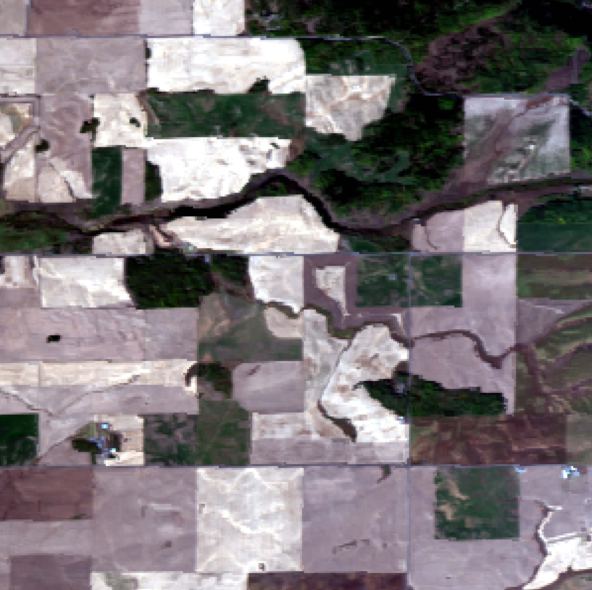
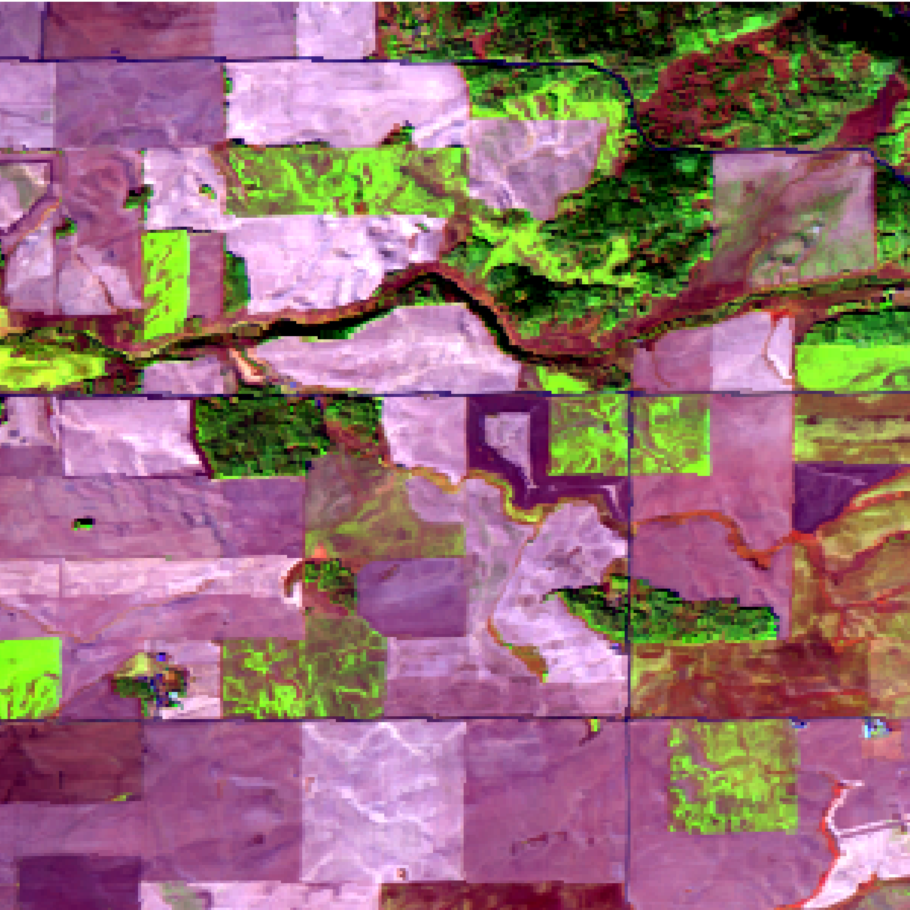

# 👋 Hi there, I'm **Mathieu Chesneau**!

## 🚀 About Me
I'm a French PhD student working with satellite remote sensing data, with a focus on developing novel methods for tree species identification, hydric stress monitoring, and the localization of volatile organic compound (VOC) zones. My passion lies in harnessing spaceborne remote sensing technologies to drive solutions for environmental sustainability and disaster monitoring.

- 🔭 I’m currently pursuing my PhD at [**Diginove**](https://www.diginove.com/) and [**Institut Fresnel**](https://www.fresnel.fr/)
- 🎓 **PhD Title**: *Development of Satellite Image Processing for Tree Species Identification, Hydric Stress Monitoring, and Localization of Volatile Organic Compound Zones*
- 🌱This work focuses on applying techniques of image processing (single band, multi and/or hyper-spectral), data fusion (with Radar and/or LiDar data) and AI to fight against forest fires

## 🌿 Making the Data Talk

An Hyperspectral Image displayed as "Human Vision", compared to the same image visualized in "False Color" to highlight areas with high moisture (in green), such as bodies of water or healthy vegetation.

<table>
  <thead>
    <tr>
      <th>Human Vision</th>
      <th>False Color (Moisture Enhanced)</th>
    </tr>
  </thead>
  <tbody>
    <tr>
      <td></td>
      <td></td>
    </tr>
  </tbody>
</table>

<i>Source Data: <a href="https://xlim-sic.labo.univ-poitiers.fr/datasets/ICONES-HSI/?lang=en">ICONES-HSI Dataset</a></i>

---

## 🛠️ Tech Stack

---

## 🌐 Connect With Me

---

_✨ This README is generated with ❤️ by Mathieu Chesneau_
